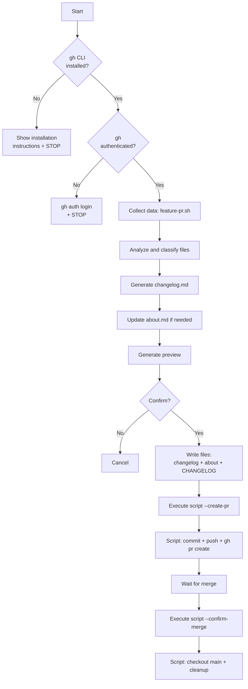

# Feature PR & Changelog Generator

> **LANG:** Respond in user's native language (detect from input). Tech terms always in English. Documents in user's language.
> **MODEL:** Use `haiku` model

Coordinator for PR creation with intelligent changelog generation. Analyzes files, filters POCOs/DTOs, detects out-of-scope implementations, feeds root CHANGELOG.md.

---

## Spec

```json
{"gates":["gh_cli_installed","gh_authenticated","feature_branch","files_analyzed","changelog_written","user_confirmed"],"order":["check_prerequisites","script_output","classify_files","analyze_high_priority","detect_out_of_scope","generate_feature_changelog","update_about","preview","write_files","execute_script"],"outputs":{"feature_changelog":"docs/features/${FEATURE_ID}/changelog.md","about_addendum":"docs/features/${FEATURE_ID}/about.md","root_changelog":"CHANGELOG.md"}}
```

---

## ⛔⛔⛔ MANDATORY SEQUENTIAL EXECUTION ⛔⛔⛔

**STEPS IN ORDER:**
```
STEP 0: Check gh CLI         → VERIFY FIRST
STEP 1: feature-pr.sh         → RUN SECOND
STEP 2: Classify files        → BY priority
STEP 3: Analyze HIGH files    → READ before describe
STEP 4: Detect out-of-scope   → COMPARE with about.md
STEP 5: Generate changelog    → FEATURE directory
STEP 6: Update about.md       → ONLY IF out-of-scope
STEP 7: Preview               → REQUIRES user confirmation
STEP 8: Write files           → BEFORE --create-pr script
STEP 9: Execute script        → CREATES PR automatically
```

**⛔ ABSOLUTE PROHIBITIONS:**

```
IF gh CLI NOT INSTALLED:
  ⛔ DO NOT USE: Bash for feature-pr.sh
  ⛔ DO NOT USE: Bash for any git operations
  ⛔ DO NOT: Proceed to any other step
  ✅ DO: Show installation instructions and STOP

IF gh NOT AUTHENTICATED:
  ⛔ DO NOT USE: Bash for feature-pr.sh
  ⛔ DO NOT USE: Bash for any git operations
  ⛔ DO NOT: Proceed to any other step
  ✅ DO: Show authentication instructions and STOP

IF STATUS=ERROR FROM SCRIPT:
  ⛔ DO NOT USE: Write to create changelog
  ⛔ DO NOT USE: Bash for git operations
  ⛔ DO: Show error and stop

IF FILES NOT ANALYZED:
  ⛔ DO NOT USE: Write to create changelog.md
  ⛔ DO NOT: Generate preview
  ✅ DO: Classify and analyze files FIRST

IF USER NOT CONFIRMED:
  ⛔ DO NOT USE: Write to create files
  ⛔ DO NOT USE: Bash for feature-pr.sh --create-pr
  ⛔ DO: Wait for explicit confirmation

IF CHANGELOG NOT WRITTEN:
  ⛔ DO NOT USE: Bash for feature-pr.sh --create-pr
  ⛔ DO: Write all files (changelog.md + about.md + CHANGELOG.md) FIRST

ALWAYS:
  ⛔ DO NOT USE: Bash for git add/commit/push manually (script --create-pr handles everything)
  ⛔ DO NOT: Describe POCOs/DTOs/entities in detail
  ⛔ DO NOT: Proceed without gh CLI installed and authenticated
```

---

## STEP 0: Check Prerequisites (VERIFY FIRST)

**CRITICAL: Execute BEFORE any other action**

### 0.1 Check gh CLI Installation

```bash
command -v gh >/dev/null 2>&1 && echo "OK" || echo "NOT_FOUND"
```

**IF NOT_FOUND:**

Display installation instructions and STOP:

```
❌ GitHub CLI (gh) not found!

gh CLI is required to create Pull Requests automatically.

📦 How to install:

Windows:
  winget install --id GitHub.cli

  or download from: https://cli.github.com/

macOS:
  brew install gh

Linux:
  # Debian/Ubuntu
  sudo apt install gh

  # Fedora/RHEL
  sudo dnf install gh

  # Arch
  sudo pacman -S github-cli

After installation, authenticate:
  gh auth login

When ready, execute /pr again.
```

**⛔ STOP EXECUTION** if gh CLI not installed.

### 0.2 Check gh Authentication

**IF gh CLI installed:**

```bash
gh auth status
```

**IF NOT AUTHENTICATED:**

Display authentication instructions and STOP:

```
⚠️ gh CLI is not authenticated!

Execute:
  gh auth login

Follow the instructions and then execute /pr again.
```

**⛔ STOP EXECUTION** if not authenticated.

**IF AUTHENTICATED:** Proceed to STEP 1.

---

## STEP 1: Collect Data (RUN SECOND)

```bash
bash .add/scripts/feature-pr.sh
```

**Output:** `FEATURE_ID`, `FEATURE_DIR`, `CHANGED_FILES`, `PENDING_CHANGES`

**IF STATUS=ERROR:** Show error and stop.

---

## STEP 2: Classify Files by Priority

**Classification patterns:**

```json
{"high":{"patterns":["services","usecases","handlers","controllers","endpoints","repositories","hooks","stores","contexts","validators","rules","pages","components"],"action":"include with description ~10 words"},"medium":{"patterns":["types","interfaces","utils","helpers","config","*.test.*","*.spec.*"],"action":"include without detailed description"},"low":{"patterns":["models","entities","dtos","requests","responses","migrations","*.css","*.scss","constants","enums"],"action":"count only"}}
```

**For each file in CHANGED_FILES:**

| Priority | Patterns | Action |
|----------|----------|--------|
| 🔴 HIGH | services, usecases, handlers, controllers, endpoints, repositories, hooks, stores, contexts, validators, rules, pages, components | READ + describe ~10 words + list main methods |
| 🟡 MEDIUM | types, interfaces, utils, helpers, config, tests | Include in list without detailed description |
| ⚪ LOW | models, entities, dtos, requests, responses, migrations, styles, constants, enums | Count only (do not describe) |

---

## STEP 3: Analyze HIGH Priority Files (READ before describe)

**For each 🔴 HIGH file:**

1. **READ file content**
2. **Generate description:** ~10 words
3. **List main methods/functions**

**Format:**

```
📄 src/services/PaymentService.ts
   Desc: Orchestrates payment with validation and Stripe integration
   Impl: processPayment(), refundPayment()
```

**⛔ DO NOT describe POCOs, DTOs, entities, or models in detail.**

---

## STEP 4: Detect Out-of-Scope Implementations (COMPARE with about.md)

### 4.1 Load Feature Context

```bash
cat docs/features/${FEATURE_ID}/about.md
```

**Extract:** Objective, Scope (Included/Excluded), Business Rules, Technical Decisions

### 4.2 Compare Scope vs Implementations

**Mark as OUT-OF-SCOPE if:**
- Different domain than defined
- Functionality not mentioned in scope
- Integration not planned
- Refactor not related to feature

**Register reason:** dependency | improvement | discovery | refactor

---

## STEP 5: Generate Feature Changelog

**Path:** `docs/features/${FEATURE_ID}/changelog.md`

**Template:**

```markdown
# Changelog: ${FEATURE_ID}
> **Date:** ${TODAY} | **Branch:** ${BRANCH_NAME}

## Summary
[2-3 sentence synthesis]

## Main Files

### Core & Business Logic
| File | Description |
|------|-------------|
| `path/file.ts` | [~10 words] |

**Implementations:** `File`: method1(), method2()

### Types & Utils
[simple list]

### Statistics
Total: X | High: Y | Medium: Z | Low: W

## Out of Original Scope
| Item | File | Reason |
|------|------|--------|
| [desc] | `path` | [reason] |

_Generated by /pr on ${TODAY}_
```

---

## STEP 6: Update about.md (ONLY IF out-of-scope detected)

**IF out-of-scope detected, append to about.md:**

```markdown
---

## Addendum: Additional Deliveries
> Updated on ${TODAY}

| Delivery | Description | Justification |
|----------|-------------|---------------|
| [Name] | [What] | [Why] |

**Impact:** [brief]
```

---

## STEP 7: Preview & Confirmation (REQUIRES user confirmation)

Display preview:

```
📋 Feature: ${FEATURE_ID}
Summary: [2-3 sentences]
Top 5 files: [list with description]
Stats: X business | Y support | Z ignored
Out of Scope: [Yes/No + list]

Actions to execute:
1) Write docs/features/${FEATURE_ID}/changelog.md
2) Write docs/features/${FEATURE_ID}/about.md addendum (if applicable)
3) Write CHANGELOG.md root
4) Execute: bash .add/scripts/feature-pr.sh --create-pr
   - Commit pending changes
   - Append file list to changelog
   - Commit changelog
   - Push to origin
   - Create PR via gh CLI

Confirm? (yes/no)
```

**⛔ IF USER NOT CONFIRMED:**
- ⛔ DO NOT USE: Write to create files
- ⛔ DO NOT USE: Bash for --create-pr
- ⛔ DO: Wait for explicit confirmation

**IF CONFIRMED:** Proceed to STEP 8.

---

## STEP 8: Write Files (BEFORE --create-pr script)

**MANDATORY ORDER:**

1. Write `docs/features/${FEATURE_ID}/changelog.md`
2. Write `docs/features/${FEATURE_ID}/about.md` addendum (if out-of-scope detected)
3. Write `CHANGELOG.md` root

### 8.1 Feature Changelog

Already generated in STEP 5.

### 8.2 About.md Addendum

Already generated in STEP 6 (if applicable).

### 8.3 CHANGELOG.md Root

**Path:** `CHANGELOG.md`

**IF file not exists:** Create with header `# Changelog\nFeature history.`

**APPEND AT TOP (after header):**

```markdown
## [${TODAY}] ${FEATURE_ID}

### Summary
[2-4 sentences]

### Main Deliveries
| Component | Description |
|-----------|-------------|
| `Name` | [~15 words] |

### Out of Original Scope *(only if exists)*
| Item | Justification |
|------|---------------|
| [Item] | [Reason] |

### Statistics
Business: X | Support: Y | Total: Z
```

---

## STEP 9: Execute Script (CREATES PR automatically)

**Execute immediately after STEP 8:**

```bash
bash .add/scripts/feature-pr.sh --create-pr
```

**Script actions:**
1. Commit pending changes
2. Append file list to changelog
3. Commit changelog
4. Push to origin
5. Create PR via `gh pr create`

**⛔ DO NOT USE: Bash for git add/commit/push manually. The --create-pr script handles everything.**

**Output:**

```
✅ PR Created!
🔗 ${PR_URL} | 📋 ${FEATURE_ID} | 🎯 ${MAIN_BRANCH}

Next steps: 1) Code review 2) Merge 3) Notify me when merged
```

---

## STEP 10: Confirm Merge (AFTER PR merged)

**Execute when PR is merged:**

```bash
bash .add/scripts/feature-pr.sh --confirm-merge
```

**Script actions:**
1. Checkout main
2. Pull latest
3. Delete local branch

**Output:** `✅ Feature Completed! Use /feature for next.`

---

## Rules

ALWAYS:
- Check gh CLI installation before any other step
- Stop execution if gh is not installed or authenticated
- Read HIGH priority files before describing them
- Compare implementations with about.md to detect out-of-scope
- Keep file descriptions to approximately ten words
- Document all out-of-scope items with justification
- Write all files before executing --create-pr script
- Append CHANGELOG.md entries at top after header
- Wait for explicit user confirmation before STEP 8

NEVER:
- Proceed without gh CLI installed and authenticated
- Describe POCOs, DTOs, or entities in detail
- Assume scope without reading about.md first
- Execute --create-pr without user confirmation
- Execute --confirm-merge without PR being merged
- Delete remote branches manually
- Use Bash for git operations manually (script handles everything)

---

## Error Handling

| Error | Action |
|-------|--------|
| gh CLI not found | Show installation instructions + STOP |
| gh not authenticated | Show gh auth login instructions + STOP |
| about.md not found | Degrade: changelog without scope comparison |
| File unreadable | Mark as 'not analyzed' |
| >50 files | Analyze top 20 HIGH only + count rest |
| PR creation failed | Verify gh auth status |
| CHANGELOG.md not exists | Create with header |

---

## Workflow Summary


